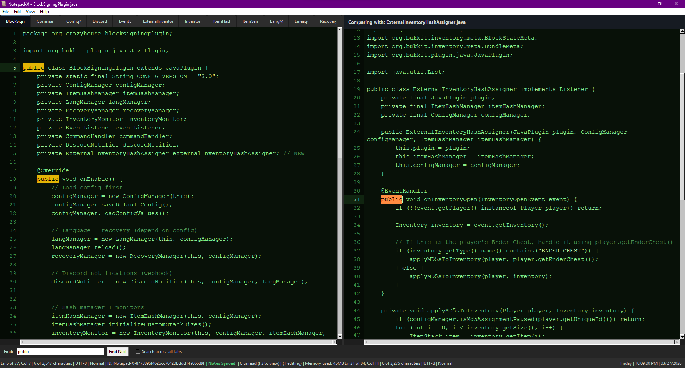
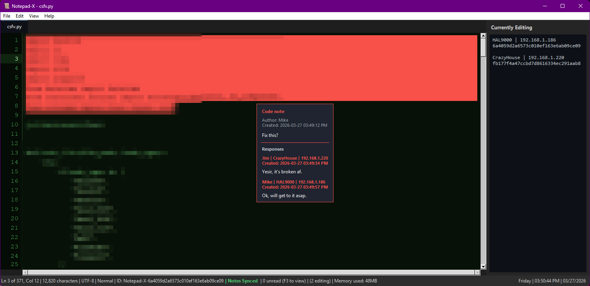
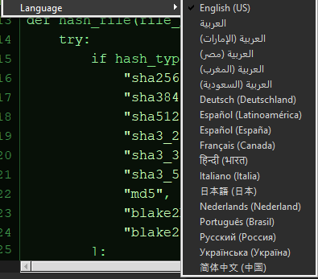
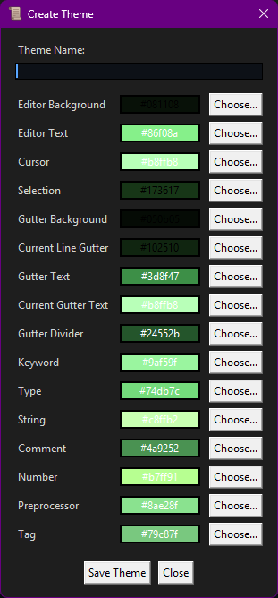

# Notepad-X

Notepad-X is a tabbed desktop text editor focused on everyday writing, shared notes, side-by-side comparison, and safer handling of large files.

It keeps a simple desktop-editor feel, but adds persistent sessions, live search, visual themes, compare mode, encrypted saves, note sharing, crash-safe recovery, and a built-in help viewer.

## Benchmark Snapshot

The image presents a performance comparison between Microsoft Notepad and Notepad-X across several metrics. Notepad-X shows a slightly faster average launch time and dramatically lower memory usage compared to Microsoft Notepad, indicating a more lightweight footprint. However, it exhibits higher CPU usage during startup, with noticeable spikes in the CPU timeline, suggesting heavier initial processing. Disk activity is also significantly higher for Notepad-X, while Microsoft Notepad remains minimal and consistent across all metrics. Overall, Notepad-X appears optimized for memory efficiency and speed but at the cost of increased CPU and disk usage during execution.

## Features

- Tabbed editing with persistent file-backed sessions
- Tabs remember your caret and scroll position when you switch away and come back
- Recent files, `Open Project`, and `Grab Git`
- Drag-reorder tabs
- GitHub-style line number gutter with click-to-copy line support
- Auto-indent on Enter
- Live bracket matching for `()`, `[]`, and `{}`
- Local autocomplete using words from the current document
- Optional `Edit with Notepad-X` Explorer right-click integration for supported text files
- Live Find and Find/Replace
- Optional `Search across all tabs`
- Multiple built-in visual themes plus a custom theme creator
- Large-file protection with buffered virtual mode
- `Save Copy As` for huge read-only files
- `Save As Encrypted` for passphrase-protected encrypted copies
- Background large-file loading so the UI stays responsive while big text files open
- Color-coded shared notes on selected text
- Shared note sidecars with unread tracking and multi-response note threads
- Export notes to JSON or Markdown
- Inline compare mode inside the main editor
- `Find Next`, `Find Previous`, `F3`, and `Shift+F3` follow the active pane during compare mode
- Crash recovery for unsaved tabs and modified file-backed tabs
- Conflict detection before saving if a file changed on disk
- Safer handling of malformed, oversized, and binary-like files
- Status bar with line info, memory usage, note sync state, editor ID, compare status, and live clock
- Word Wrap, Sound toggle, Full Screen, zoom controls, font picker, printing
- `View > Numbered Lines` toggle with saved preference
- `View > Autocomplete` toggle with saved preference
- `Edit > Edit with Notepad-X` toggle with saved preference
- `Edit > Sound` toggle with saved preference
- `Edit > Language` menu for switching the visible UI language
- Friendly native language names in the Language menu with locale-aware font fallback
- `View > Currently Editing` opens a right-side live editor sidebar
- Built-in Help viewer and About dialog
- About shows `v1.0.0` and a clickable GitHub link

## Grab Git

Notepad-X can download a public GitHub project and then let you choose which files to open.

- `File > Grab Git` or `Ctrl+Shift+G` starts the flow
- enter the project as `username/project`
- choose where the GitHub project should be saved
- after the download finishes, Notepad-X shows the project root folder and lets you select one or several files to open

## Compare Mode

Notepad-X can compare two open tabs side by side inside the main window.

- `View > Compare Tabs` or `Ctrl+Q` opens compare mode
- the normal editor stays usable on the left
- the compared file appears on the right
- both sides are editable for normal tabs
- the compared file shows its own bottom compare status readout
- `Currently Editing` stays as a separate far-right sidebar even while compare mode is open
- opening and closing the sidebar restores the compare split evenly
- `Find Next`, `Find Previous`, `F3`, and `Shift+F3` follow whichever compare pane you last clicked
- `Ctrl+Shift+X` closes compare mode
- if you close the app while compare mode is open, the same compare pair is restored on next launch

  

## Line Numbers

Notepad-X includes a GitHub-style line number gutter on the left side of the editor.

- line numbers are enabled by default
- `View > Numbered Lines` hides or shows the gutter
- the setting is remembered across launches
- clicking a line number copies that whole line to the clipboard
- a small in-window notification appears beside the clicked gutter line

## Autocomplete

Notepad-X includes a lightweight local autocomplete system for normal editable tabs.

- enabled by default
- `View > Autocomplete` hides or shows it
- the setting is remembered across launches
- suggestions are based on matching words from the current tab
- the popup appears under the caret while typing
- `Up` / `Down` move through suggestions
- `Tab` or `Enter` accepts the selected suggestion
- `Esc` closes the popup

## Find Behavior

- live search highlights matches while you type
- live search does not move the caret while typing
- pressing `Enter` in the Find or Replace query box jumps to the first match from the top
- the caret lands at the end of that found match
- `Find Next` / `F3` move forward through matches
- `Find Previous` / `Shift+F3` move backward through matches

## Shared Notes

You can select text, right-click, and attach a shared note to the selection.

Notes support:

- yellow, green, red, or light blue note colors
- note author, machine name, LAN IP, and local-time timestamp display
- multiple responses on the same note
- right-click `Respond` workflow
- unread tracking between editors
- `F3` to jump unread notes
- `F4` to cycle notes
- shared sidecar files for collaboration
- export to JSON or Markdown

  

## Languages

Notepad-X includes a translation layer for visible UI text.

- `Edit > Language` shows friendly locale names instead of raw codes
- additional languages appear automatically in the Language menu
- the selected language is saved in the session and restored on launch
- current language coverage includes the main menus, displayed hotkeys, status bar text, note popup labels, and core dialog captions
- Arabic language support automatically switches the UI text direction to right-to-left
- locale changes can also switch the editor font to a better installed script-friendly fallback automatically

  

## Themes

- built-in themes are included out of the box
- `View > Syntax Theme > Create Theme` opens a color-picker dialog for building a new theme
- new themes appear in the menu immediately

  

## Encrypted Files

Notepad-X can create and open encrypted document copies.

- `Save As Encrypted` creates encrypted `.npxe` files
- encrypted save suggests `file.ext.npxe` automatically
- Notepad-X detects its encrypted format on open and asks for the passphrase
- normal `Save As` and `Save Copy As` remain plain-text save flows

## Large File Handling

Large files now load more safely in the background so the UI does not freeze while opening them.

Editable large text files are allowed up to a practical limit, and only extremely large files fall back to buffered virtual mode.

In large-file virtual mode:

- navigation stays usable
- line tracking still works
- only a moving window of the file is loaded
- editing is disabled
- direct saving is disabled
- `Save Copy As` is available for copying the source file elsewhere

Notepad-X also treats binary-like files more cautiously:

- binary-looking content is previewed as safe text instead of being treated like a normal editable text document
- malformed or unusual encodings are opened with replacement instead of crashing the app

## File Safety

- normal saves use an atomic temp-file replace pattern
- note and session support files are also written atomically
- if a file changed on disk after it was opened, Notepad-X asks before overwriting it
- recovery restores into tabs instead of overwriting user files directly
- crash recovery can restore both untitled work and modified file-backed tabs
- permissions errors are shown to the user instead of failing silently

## Main Shortcuts

- `Ctrl+W` Open
- `Ctrl+Shift+W` Open Project
- `Ctrl+Shift+G` Grab Git
- `Ctrl+T` New Tab
- `Ctrl+Shift+T` Close Tab
- `Ctrl+S` Save
- `Ctrl+Shift+S` Save all
- `Ctrl+Shift+Q` Save Copy As
- `Ctrl+Shift+E` Save As Encrypted
- `Ctrl+E` Export Notes
- `Ctrl+P` Print
- `Ctrl+Shift+X` Close compare / close Find or Replace / exit
- `Ctrl+F` Find
- `Shift+F3` Find previous
- `Ctrl+R` Replace
- `F3` Find next or next unread note
- `F4` Cycle notes
- `Ctrl+G` Go To Line
- `Ctrl+PgUp` Top of Document
- `Ctrl+PgDn` Bottom of Document
- `Ctrl+D` Date
- `Ctrl+Shift+D` Time/Date
- `Ctrl+Shift+F` Font
- `Ctrl+A` Select All
- `Ctrl+B` Show / hide status bar
- `Ctrl+Tab` Switch Tab
- `Ctrl+Q` Compare Tabs
- `Ctrl++` Zoom in
- `Ctrl+-` Zoom out
- `F11` Full Screen
