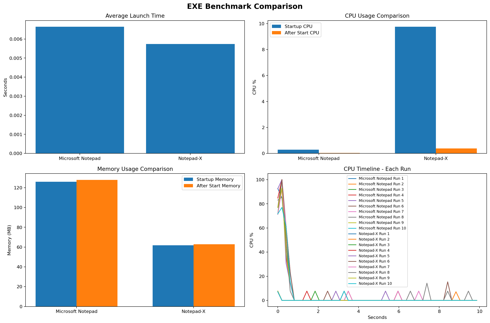

# Notepad-X

Notepad-X is a tabbed desktop text editor for plain text, source code, shared code notes, and safer handling of large files.

It keeps a simple desktop-editor feel, but adds project opening, persistent sessions, syntax highlighting, live search, collaborative note sidecars, inline compare mode, recovery, and a built-in help viewer.

## Benchmark Snapshot

This benchmark compares the packaged Notepad-X build against Microsoft Notepad. In this run, launch times are very close, Notepad-X uses more CPU during startup, and it settles at a lower memory footprint than Microsoft Notepad. The CPU timeline also shows both applications spiking at startup and then dropping back quickly, with Notepad-X stabilizing after initialization.

## Features

- Tabbed editing with persistent file-backed sessions
- Tabs remember your caret and scroll position when you switch away and come back
- Recent files and `Open Project`
- Drag-reorder tabs
- GitHub-style line number gutter with click-to-copy line support
- Local autocomplete popup with syntax keywords and current-document word matching
- Optional `Edit with Notepad-X` Explorer right-click integration for supported text/code file types
- Live Find and Find/Replace
- Optional `Search across all tabs`
- Syntax highlighting for many source and config formats
- Syntax theme presets and manual syntax override per tab
- Large-file protection with buffered virtual mode
- `Save Copy As` for huge read-only files
- `Save As Encrypted` for passphrase-protected encrypted copies
- Save dialogs with text, markdown, `.gitignore`, and code/config file type filters
- Color-coded shared notes on selected text
- Shared note sidecars with unread tracking
- Export notes to JSON or Markdown
- Inline compare mode inside the main editor
- `Find Next`, `Find Previous`, `F3`, and `Shift+F3` follow the active pane during compare mode
- Autosave recovery for unsaved untitled tabs after a crash
- Crash logging for important failures and unhandled exceptions
- Conflict detection before saving if a file changed on disk
- Atomic writes for notes, session, recovery, editor identity, and JSON exports
- Safer handling of malformed, oversized, and binary-like files
- Status bar with line info, memory usage, note sync state, editor ID, and live clock
- Word Wrap, Sound toggle, Full Screen, zoom controls, font picker, printing
- `View > Numbered Lines` toggle with saved preference
- `View > Autocomplete` toggle with saved preference
- `View > Edit with Notepad-X` toggle with saved preference
- `Edit > Language` menu that scans `cfg/*.cfg` and lets you switch UI language files
- Built-in Help viewer and About dialog

## Compare Mode

Notepad-X can compare two open tabs side by side inside the main window.

- `View > Compare Tabs` or `Ctrl+Q` opens compare mode
- the normal editor stays usable on the left
- the compared file appears on the right
- both sides are editable for normal tabs
- syntax highlighting is applied on the compare side too
- the compared file shows its own bottom compare status readout
- `Find Next`, `Find Previous`, `F3`, and `Shift+F3` follow whichever compare pane you last clicked
- `Ctrl+Shift+X` closes compare mode
- if you close the app while compare mode is open, the same compare pair is restored on next launch

## Line Numbers

Notepad-X includes a GitHub-style line number gutter on the left side of the editor.

- line numbers are enabled by default
- `View > Numbered Lines` hides or shows the gutter
- the setting is remembered across launches
- clicking a line number copies that whole line to the clipboard
- a small in-window notification appears beside the clicked gutter line

## Autocomplete

Notepad-X includes a lightweight local autocomplete system for normal editable tabs.

- enabled by default
- `View > Autocomplete` hides or shows it
- the setting is remembered across launches
- suggestions combine syntax keywords with matching words from the current tab
- the popup appears under the caret while typing
- `Up` / `Down` move through suggestions
- `Tab` or `Enter` accepts the selected suggestion
- `Esc` closes the popup

## Find Behavior

- live search highlights matches while you type
- live search does not move the caret while typing
- pressing `Enter` in the Find or Replace query box jumps to the first match from the top
- the caret lands at the end of that found match
- `Find Next` / `F3` move forward through matches
- `Find Previous` / `Shift+F3` move backward through matches

## Code Notes

You can select text, right-click, and attach a shared note to the selection.

Notes support:

- yellow, green, red, or light blue note colors
- note author and local-time timestamp display
- multiple responses on the same note
- right-click `Respond` workflow
- unread tracking between editors
- `F3` to jump unread notes
- `F4` to cycle notes
- shared sidecar files for collaboration
- export to JSON or Markdown

## Language Files

Notepad-X now includes a translation/config layer for visible UI text.

- `cfg/en_us.cfg` is the default English language file
- `Edit > Language` shows `en_us` selected by default
- any additional `cfg/*.cfg` file appears automatically in the Language menu
- the selected language is saved in the session and restored on launch
- current language coverage includes the main menus, displayed hotkeys, status bar text, note popup labels, and core dialog captions

## Encrypted Files

Notepad-X can create and open encrypted document copies.

- `Save As Encrypted` creates encrypted `.npxe` files
- encrypted save suggests `file.ext.npxe` automatically
- Notepad-X detects its encrypted format on open and asks for the passphrase
- normal `Save As` and `Save Copy As` remain plain-text save flows
- encryption uses:
  - `scrypt` for passphrase-based key derivation
  - `AES-256-GCM` for authenticated encryption
  - a random salt and nonce per file
- encrypted open/save support requires the Python `cryptography` package

## Large File Handling

Very large files are protected with a buffered virtual mode so Notepad-X does not try to load the entire file into the Tk text widget at once.

In large-file virtual mode:

- navigation stays usable
- line tracking still works
- only a moving window of the file is loaded
- editing is disabled
- direct saving is disabled
- `Save Copy As` is available for copying the source file elsewhere

Notepad-X also treats binary-like files more cautiously:

- binary-looking content is previewed as safe text instead of being treated like a normal editable text document
- malformed or unusual encodings are opened with replacement instead of crashing the app

## File Safety

- normal saves use an atomic temp-file replace pattern
- JSON support files and note sidecars are also written atomically
- if a file changed on disk after it was opened, Notepad-X asks before overwriting it
- recovery restores into tabs instead of overwriting user files directly
- permissions errors are shown to the user instead of failing silently
- shell and print integrations validate file paths before sending them to Windows

## Requirements

- Python 3.11
- Tkinter available in the Python install
- `cryptography` installed if you want `.npxe` encrypted files

## Main Shortcuts

- `Ctrl+W` Open
- `Ctrl+Shift+W` Open Project
- `Ctrl+T` New Tab
- `Ctrl+Shift+T` Close Tab
- `Ctrl+S` Save
- `Ctrl+Shift+S` Save all
- `Ctrl+Shift+Q` Save Copy As
- `Ctrl+Shift+E` Save As Encrypted
- `Ctrl+P` Print
- `Ctrl+E` Export Notes
- `Ctrl+Shift+X` Close compare / close Find or Replace / exit
- `Ctrl+F` Find
- `Shift+F3` Find previous
- `Ctrl+R` Replace
- `F3` Find next or next unread note
- `F4` Cycle notes
- `Ctrl+G` Go To Line
- `Ctrl+PgUp` Top of Document
- `Ctrl+PgDn` Bottom of Document
- `Ctrl+D` Date
- `Ctrl+Shift+D` Time/Date
- `Ctrl+Shift+F` Font
- `Ctrl+A` Select All
- `Ctrl+B` Show / hide status bar
- `Ctrl+Tab` Switch Tab
- `Ctrl+Q` Compare Tabs
- `Ctrl++` Zoom in
- `Ctrl+-` Zoom out
- `F11` Full Screen

## Support Files

Notepad-X keeps support files for sessions, editor identity, recovery, crash logging, and shared notes.

These can include:

- `cfg/en_us.cfg`
- `cfg/Notepad-X.<host>-<user>.session.json`
- `cfg/Notepad-X.<host>-<user>.editor.json`
- `Notepad-X.recovery.json`
- `Notepad-X.crash.log`
- `*.notepadx.notes.json`
